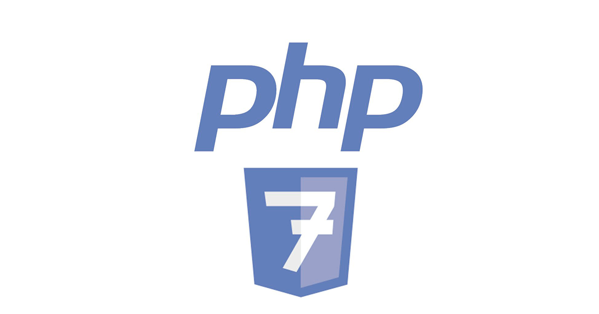
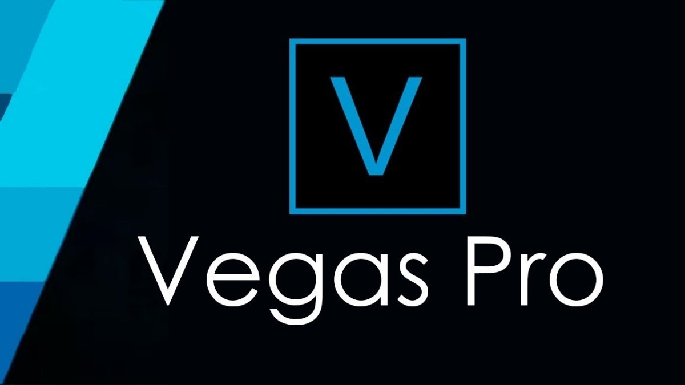

### Hi there 👋

# My name is Eduardo Ezequiel

#### I work as a developer for 4 years, I am trained in information systems, I like and share knowledge through technology in favor of evolution.

 

### Connect with me: 

 

[][linkedin]   

### Languages and Tools:

   

 

   

[linkedin]: https://www.linkedin.com/in/eduardo-ezequiel-371a8b145/
